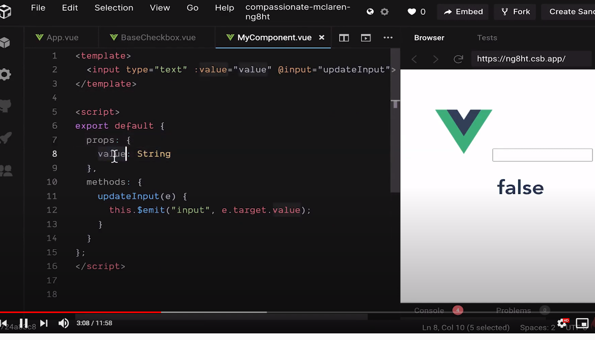
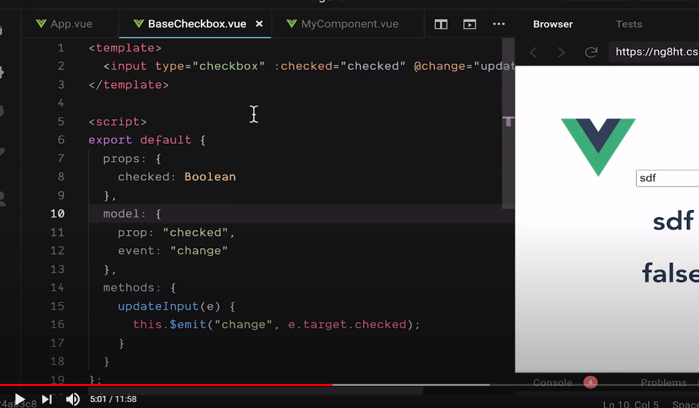

# vue3.0 组件自定义v-model

## 在vue2.0 中 组件自定义v-model
> 一 .默认
>> 1. props中定义一个名称为value的值
>> 2. 自定义事件名称为 input
>> 

> 二 .自定义props名称 和 事件名称
>> 通过 model对象, prop 和 event 定义
>> 

## 在vue3.0中 组件自定义v-model
>> 1. props中名称为modelValue
>> 2. 事件名称, updateModel
```
/.... template代码块
 <input
      type="text"
      class="form-control"
      id="exampleInputEmail1"
      aria-describedby="emailHelp"
      :value="inputRef.val"
      @input="updateValue"
 />
.../

/... script 代码块
  props: {
    modelValue: String,
  },
  setup(){
      const inputRef = reactive({
        val: props.modelValue || "",
        error: false,
        message: "",
      });

    const updateValue = (e: KeyboardEvent) => {
      if (e.target) {
        const targetValue = (e.target as HTMLInputElement).value;
        inputRef.val = targetValue;
        context.emit("update:modelValue", targetValue);
      }
    };

    return {
        inputRef,
        updateValue
    }
  }
  .../

```
